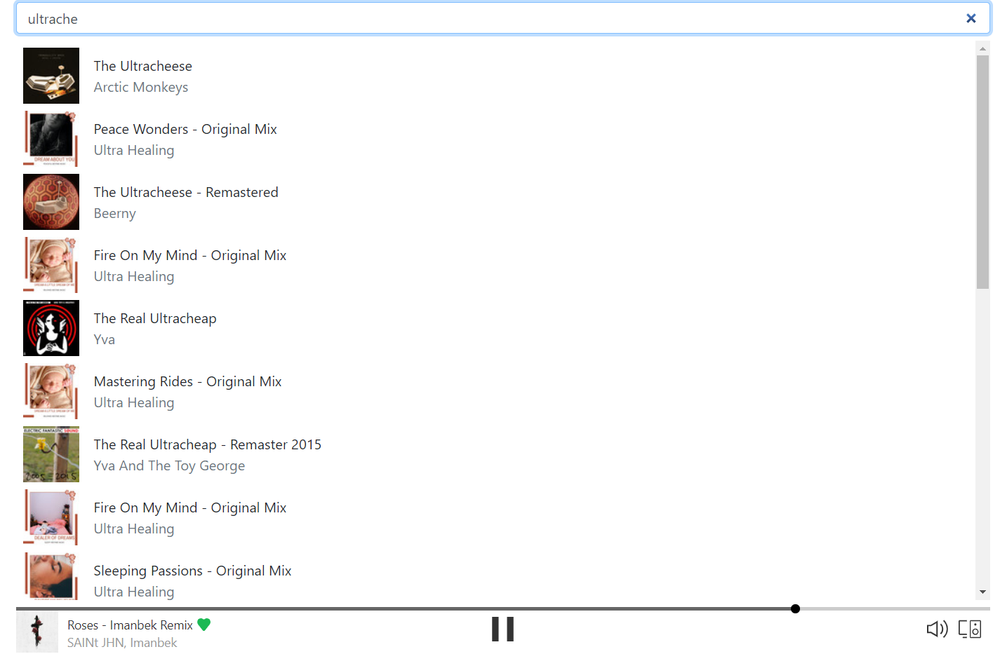
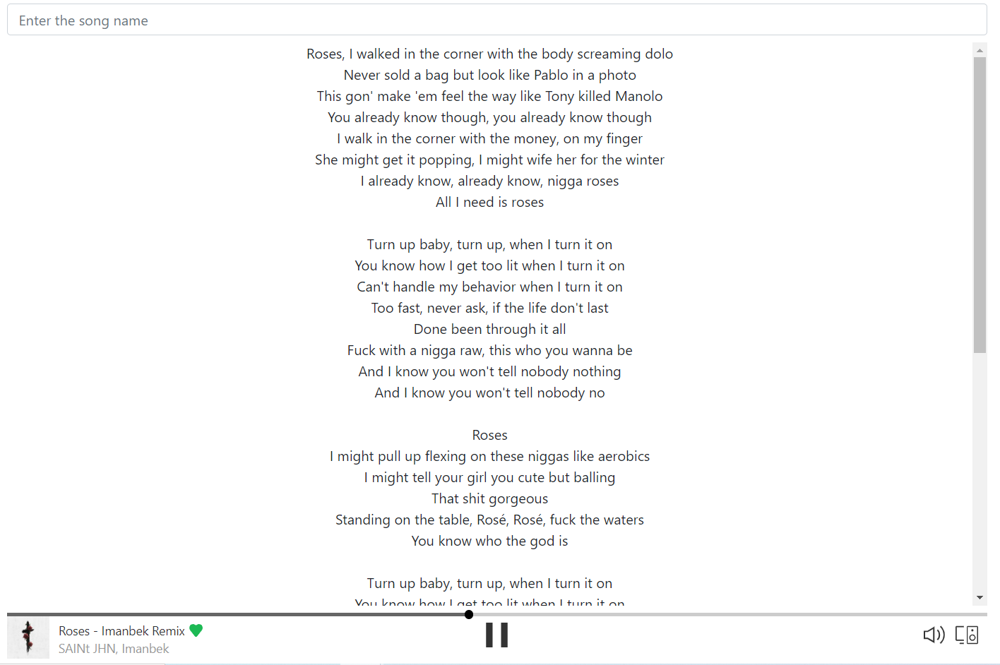

# Spotify-Clone


created a Custom hook `useAuth` for Authentication 


## Client
```shell
cd client
npm install 
npm start
```


## Server 
```shell
cd server 
npm install
npm start
```


SERVER .env FORTMAT

```
CLIENT_SECRET=

PORT=4000
```
## Screenshots 
Searching the track 


Lyrics and player 

